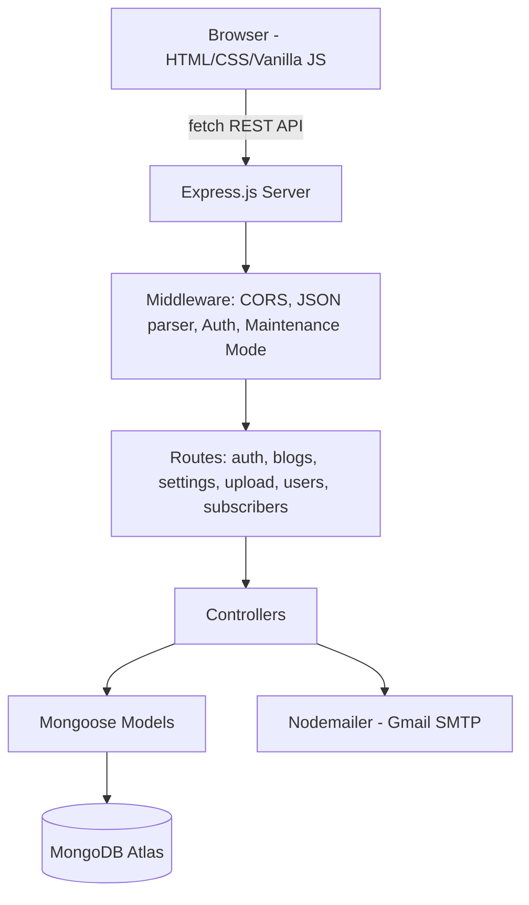

# BlogSphere

A full-stack blog publishing platform with role-based content moderation, built with vanilla JavaScript on the frontend and a Node.js/Express REST API backed by MongoDB on the backend.

**Live Backend API:** [https://blogsphere-wtrv.onrender.com](https://blogsphere-wtrv.onrender.com)
**Repository:** [github.com/ArunPragas2001/BlogApp](https://github.com/ArunPragas2001/BlogApp)

---

## Table of Contents

- [Project Overview](#project-overview)
- [Features](#features)
- [Technologies Used](#technologies-used)
- [System Architecture](#system-architecture)
- [Project Structure](#project-structure)
- [API Documentation](#api-documentation)
- [Database](#database)
- [Authentication & Security](#authentication--security)
- [Installation & Setup](#installation--setup)
- [Environment Variables](#environment-variables)
- [Running the Application Locally](#running-the-application-locally)
- [Deployment](#deployment)
- [Future Improvements](#future-improvements)
- [Learning Outcomes](#learning-outcomes)
- [Internship / Project Information](#internship--project-information)
- [Author](#author)
- [License](#license)

---

## Project Overview

BlogSphere is a full-stack web application that lets users register, write, and publish blog posts, while giving site administrators moderation and configuration tools. The frontend is built with plain HTML, CSS, and JavaScript (no framework), and communicates with a Node.js/Express REST API. Data is persisted in MongoDB via Mongoose. The application implements a three-tier role system (`user`, `admin`, `owner`), an approval workflow for blog posts, an image upload pipeline, an email notification system, and a site-wide settings/maintenance-mode panel.

## Features

Based on the actual routes, controllers, and frontend scripts in the repository:

- **User registration and login** with email/password, including client- and server-side validation.
- **JWT-based authentication** for protected API routes.
- **Password recovery** via a 6-digit email verification code (`forgot-password` / `reset-password`).
- **User profile management** — update name, email, bio, profile picture, and password (with current-password confirmation).
- **Role-based access control** with three roles: `user`, `admin`, and `owner`.
- **Admin request workflow** — users can request admin access at registration; the `owner` account approves or rejects these requests.
- **Blog creation, editing, and deletion**, with ownership checks (only the author, an admin, or the owner can modify/delete a post).
- **Blog approval workflow** — posts created by regular users require admin/owner approval before becoming publicly visible; posts created by admins/owners are auto-approved.
- **Blog listing with filtering** by category, by the current user's own posts, and an automatic expiry window (posts older than a configurable number of days are excluded from the public feed).
- **Image uploads** for blog cover images and profile pictures via a Multer-based upload endpoint (10 MB limit, image file types only).
- **Email notifications** (via Nodemailer/Gmail) for new subscriber welcomes, password reset codes, and new blog post announcements to subscribers.
- **Newsletter-style email subscription** (subscribe/list subscribers).
- **Site settings panel** — an owner-managed configuration for contact details, social links, terms of service text, blog expiry duration, and a site-wide maintenance mode toggle.
- **Maintenance mode** — when enabled, the API blocks all non-owner traffic except login.
- **User management** — admins/owners can view all users; the owner can block/unblock or permanently delete a user.
- **Dark mode toggle** on the frontend (`theme.js`, `darkmode.css`).
- **Toast notification system** for frontend feedback (`toast.js`).
- **Responsive, multi-page frontend** — Home, Login, Register, Dashboard, Create/Edit Blog, Profile, and Admin Settings pages.

> **Note:** The requested endpoints `GET /api/auth/me` and `PUT /api/auth/profile` exist as described. The project also implements several additional endpoints (password reset, admin approval, user management, image upload, and subscribers) that were not in the original endpoint list but are present and active in the source code, so they are documented below for accuracy.

## Technologies Used

| Technology | Purpose |
|---|---|
| HTML5 | Page structure/markup for all frontend views |
| CSS3 | Styling, layout, and dark-mode theming |
| JavaScript (Vanilla) | Frontend interactivity and API communication |
| Node.js | Backend JavaScript runtime |
| Express.js | REST API framework and routing |
| MongoDB | NoSQL document database |
| MongoDB Atlas | Cloud-hosted database (production) |
| Mongoose | ODM for schema modeling and MongoDB queries |
| JSON Web Tokens (jsonwebtoken) | Stateless authentication |
| bcryptjs | Password hashing |
| Multer | Multipart form-data handling for image uploads |
| Nodemailer (Gmail transport) | Transactional and notification emails |
| CORS | Cross-origin request handling |
| dotenv | Environment variable loading |
| nodemon | Auto-restarting dev server (dev dependency) |
| Git/GitHub | Version control and source hosting |
| Vercel | Frontend hosting (deployment target) |
| Render | Backend hosting (deployment target) |

## System Architecture

```
Frontend (HTML/CSS/JS)
        ↓
   REST API calls (fetch)
        ↓
 Node.js + Express Server
        ↓
  Mongoose (ODM Layer)
        ↓
   MongoDB Atlas (Cloud DB)
```



The frontend currently calls the **live Render-hosted backend URL directly** (hardcoded in each JavaScript file), rather than a locally configurable API base URL — see [Future Improvements](#future-improvements).

## Project Structure

```
BlogApp/
├── package.json                  # Root-level package file (mongoose only)
├── package-lock.json
├── README.md
└── Myblog App/
    ├── README.md
    ├── index.html                 # Home / public blog feed
    ├── login.html
    ├── register.html
    ├── dashboard.html              # User/Admin/Owner dashboard
    ├── createBlog.html             # Create/edit blog post
    ├── profile.html
    ├── adminSettings.html          # Owner-only site settings panel
    ├── Assets/
    │   └── images/                 # Static demo images
    ├── css/
    │   ├── Home.css
    │   ├── login.css
    │   ├── register.css
    │   ├── dashboard.css
    │   ├── createBlog.css
    │   ├── profile.css
    │   ├── darkmode.css
    │   ├── navigationHelpers.css
    │   └── toast.css
    ├── js/
    │   ├── main.js                 # Home page / public feed logic
    │   ├── login.js
    │   ├── register.js
    │   ├── dashboard.js             # Blog + user + admin-request management
    │   ├── createBlog.js
    │   ├── profile.js
    │   ├── adminSettings.js
    │   ├── navigationHelpers.js
    │   ├── theme.js                 # Dark mode toggle
    │   └── toast.js                 # Toast notifications
    └── backend/
        ├── server.js               # Express app entry point
        ├── package.json
        ├── config/
        │   ├── db.js                # MongoDB connection
        │   └── emailService.js      # Nodemailer email templates/senders
        ├── controllers/
        │   ├── authControl.js
        │   ├── blogControl.js
        │   ├── configControl.js
        │   ├── userControl.js
        │   └── subscriberControl.js
        ├── middleware/
        │   ├── authMiddleware.js     # JWT verification (protect)
        │   └── maintenanceMiddleware.js
        ├── models/
        │   ├── user.js
        │   ├── blog.js
        │   ├── siteConfig.js
        │   └── subscriber.js
        ├── routes/
        │   ├── authRoute.js
        │   ├── blogRoute.js
        │   ├── configRoute.js
        │   ├── uploadRoute.js
        │   ├── userRoute.js
        │   └── subscriberRoute.js
        └── uploads/                 # Uploaded image files (runtime storage)
```

> **Note:** The project has a slightly unconventional layout — the actual application lives inside a subfolder named `Myblog App` (with a space), and the backend is nested inside that folder (`Myblog App/backend`) rather than at the repository root.

## API Documentation

All endpoints are prefixed with the live base URL: `https://blogsphere-wtrv.onrender.com`

### Authentication — `/api/auth`

| Method | Endpoint | Description | Auth Required |
|---|---|---|---|
| POST | `/api/auth/register` | Register a new user (optionally request admin role) | No |
| POST | `/api/auth/login` | Log in and receive a JWT | No |
| POST | `/api/auth/forgot-password` | Request a 6-digit password reset code via email | No |
| POST | `/api/auth/reset-password` | Reset password using the emailed code | No |
| GET | `/api/auth/me` | Get the current authenticated user's profile | Yes |
| PUT | `/api/auth/profile` | Update the current user's profile / password | Yes |
| GET | `/api/auth/admin-requests` | List pending admin role requests | Yes (Owner) |
| PUT | `/api/auth/admin-requests/:id/approve` | Approve or reject an admin role request | Yes (Owner) |

### Blogs — `/api/blogs`

| Method | Endpoint | Description | Auth Required |
|---|---|---|---|
| GET | `/api/blogs` | List blogs (supports `category`, `userOnly`, `all` query params) | No |
| POST | `/api/blogs` | Create a new blog post | Yes |
| GET | `/api/blogs/:id` | Get a single blog post by ID | No |
| PUT | `/api/blogs/:id` | Update a blog post (author, admin, or owner) | Yes |
| DELETE | `/api/blogs/:id` | Delete a blog post (author, admin, or owner) | Yes |
| PUT | `/api/blogs/:id/approve` | Approve or reject a pending blog post | Yes (Admin/Owner) |

### Settings — `/api/settings`

| Method | Endpoint | Description | Auth Required |
|---|---|---|---|
| GET | `/api/settings` | Get site-wide configuration | No |
| PUT | `/api/settings` | Update site configuration / maintenance mode | Yes (Owner) |

### Users — `/api/users`

| Method | Endpoint | Description | Auth Required |
|---|---|---|---|
| GET | `/api/users` | List all users (excluding the owner) | Yes (Admin/Owner) |
| PUT | `/api/users/:id/block` | Toggle a user's blocked status | Yes (Owner) |
| DELETE | `/api/users/:id` | Permanently delete a user | Yes (Owner) |

### Uploads — `/api/upload`

| Method | Endpoint | Description | Auth Required |
|---|---|---|---|
| POST | `/api/upload` | Upload an image (blog cover, profile picture); returns a URL | Yes |

### Subscribers — `/api/subscribers`

| Method | Endpoint | Description | Auth Required |
|---|---|---|---|
| POST | `/api/subscribers/subscribe` | Subscribe an email to blog notifications | No |
| GET | `/api/subscribers` | List active subscribers | No |

> The `subscribers` list endpoint does not currently enforce authentication in the source code — see [Future Improvements](#future-improvements).

## Database

The application uses **MongoDB** as its database, with **MongoDB Atlas** as the production/cloud-hosted instance, accessed through **Mongoose** schemas. Four collections (models) are defined:

- **User** — `name`, `email` (unique), hashed `password`, `role` (`user` / `admin` / `owner`), `adminStatus`, `profilePic`, `bio`, `isBlocked`, plus password-reset fields (`resetPasswordCode`, `resetPasswordExpires`).
- **Blog** — `title`, `content`, `category`, `status` (`draft` / `published`), `isApproved`, `approvalStatus`, `image`, and an `author` reference to `User`.
- **SiteConfig** — a single-document collection storing site-wide settings: contact info, social links, terms of service text, `maintenanceMode`, and `blogExpiryDays`.
- **Subscriber** — `email` (unique) and `isActive`, used for the notification mailing list.

All schemas use Mongoose's `timestamps` option to auto-generate `createdAt` / `updatedAt` fields.

## Authentication & Security

Authentication is implemented with **JSON Web Tokens (JWT)**:

1. On registration or login, the server generates a JWT signed with `JWT_SECRET`, containing the user's ID, valid for 7 days.
2. The client stores this token (in `localStorage`, based on frontend usage) and sends it in the `Authorization: Bearer <token>` header on protected requests.
3. The `protect` middleware (`authMiddleware.js`) verifies the token, loads the corresponding user, and rejects the request if the token is invalid, the user no longer exists, or the user has been blocked.
4. Role-based checks (`user` / `admin` / `owner`) are performed inside individual controllers to restrict sensitive actions (approving blogs, managing users, editing site settings).

**Password hashing** is implemented using **bcryptjs** (salt rounds: 10) — plaintext passwords are never stored.

**Password reset** uses a 6-digit numeric code emailed to the user, valid for 15 minutes, rather than a reset link/token.

### ⚠️ Security Findings to Address Before Publishing

The following issues were found in the current source code and should be fixed **before** this repository is made public or submitted for evaluation:

- **Hardcoded owner credentials in source code.** `authControl.js` contains a hardcoded owner email and plaintext password used to auto-seed an "owner" account on server startup. This should be moved to environment variables immediately, and the exposed credentials should be treated as compromised and rotated.
- **Hardcoded JWT fallback secret.** Several files fall back to a hardcoded string as the JWT signing secret if `JWT_SECRET` is not set in the environment. This fallback should be removed so the app fails safely if the secret is missing.
- **A `.env` file is committed to the repository.** The backend's real `.env` file (containing actual database and secret values) is present in the Git history. This should be removed from version control and the repository's Git history, and all credentials inside it should be rotated (MongoDB URI/password, JWT secret).
- **Password reset code returned in the API response.** `forgotPassword` returns the 6-digit reset code directly in the JSON response body (in addition to emailing it), which defeats the purpose of email verification and would let anyone who can call the endpoint reset another user's password.
- **User-uploaded images are committed to the repository.** The `backend/uploads/` folder containing runtime-uploaded images is tracked in Git; this folder should typically be excluded via `.gitignore`.
- **No `.gitignore` file** exists anywhere in the repository, which is how `node_modules`, `.env`, and `uploads/` ended up committed.
- **Public subscriber list endpoint.** `GET /api/subscribers` has no authentication, exposing subscriber email addresses to anyone who calls it.

## Installation & Setup

```bash
# 1. Clone the repository
git clone https://github.com/ArunPragas2001/BlogApp.git

# 2. Navigate into the backend directory
cd "BlogApp/Myblog App/backend"

# 3. Install backend dependencies
npm install
```

The frontend has no build step and no `package.json` of its own — it is a set of static HTML/CSS/JS files served directly from the `Myblog App/` folder.

## Environment Variables

Create a `.env` file inside `Myblog App/backend/` with the following keys (these are the only variables actually referenced by the backend source code):

```env
PORT=5000
MONGO_URI=your_mongodb_connection_string
JWT_SECRET=your_jwt_secret
```

The email service (`config/emailService.js`) also reads `EMAIL_USER` and `EMAIL_PASS` for sending notification emails via Gmail, but currently falls back to a hardcoded Gmail address and an empty password if these are not set — it is strongly recommended to set both explicitly:

```env
EMAIL_USER=your_gmail_address
EMAIL_PASS=your_gmail_app_password
```

> **Do not commit your real `.env` file.** Add `.env`, `node_modules/`, and `backend/uploads/` to a `.gitignore` file before pushing.

## Running the Application Locally

**Backend:**

```bash
cd "Myblog App/backend"
npm install
npm run dev     # starts with nodemon (auto-restart)
# or
npm start       # starts with node
```

The server will run on `http://localhost:5000` by default (or the port set in `PORT`).

**Frontend:**

The frontend JavaScript files currently call the https://blogsphere-wtrv.onrender.com/ irectly rather than `localhost`, so opening the HTML files (e.g., via a static server or the VS Code "Live Server" extension) will talk to the production API by default. To test fully against a local backend, the `API_BASE_URL` constant at the top of each JS file (`main.js`, `login.js`, `register.js`, `dashboard.js`, `createBlog.js`, `profile.js`, `adminSettings.js`) would need to be changed to `http://localhost:5000`.

## Deployment

| Layer | Platform | URL |
|---|---|---|
| Frontend | Vercel | `https://blog-app-three-ivory.vercel.app/`  |
| Backend | Render | [https://blogsphere-wtrv.onrender.com](https://blogsphere-wtrv.onrender.com) |
| Database | MongoDB Atlas | Cloud-hosted (connection string in environment variables) |

The Express backend serves the REST API and exposes uploaded images statically at `/uploads/`. The frontend, once deployed to Vercel, communicates with the backend via CORS-enabled REST requests.


## Future Improvements

- Search functionality across blog posts
- Category-based browsing/filtering UI improvements
- Pagination for blog listings
- Cloud-based image storage (e.g., Cloudinary/S3) instead of local disk storage
- Comments on blog posts
- Likes/reactions
- Finer-grained, centrally defined role-based authorization (currently checked ad hoc per controller)
- Stronger input validation and sanitization across all endpoints
- Environment-configurable frontend API base URL (currently hardcoded per file)
- Authentication on the subscriber list endpoint
- Removal of the hardcoded owner-seeding logic in favor of a proper admin-provisioning process
- A `.gitignore` file to keep `node_modules`, `.env`, and uploaded files out of version control

## Learning Outcomes

Building BlogSphere provided hands-on experience with:

- Structuring and styling a multi-page frontend using plain HTML, CSS, and JavaScript
- Designing and building a REST API with Node.js and Express, including routing, controllers, and middleware
- Modeling relational-style references (e.g., blog-to-author) in a NoSQL database using Mongoose
- Implementing JWT-based authentication and role-based authorization
- Handling file uploads with Multer
- Integrating third-party services (Nodemailer/Gmail) for transactional email
- Performing full CRUD operations across multiple resources
- Deploying a decoupled frontend/backend application (Vercel + Render + MongoDB Atlas)
- Using Git and GitHub for version control

## Internship / Project Information

**Full Stack Web Development Internship**
**Project:** BlogSphere

## Author

**Arun Pragas**
GitHub: [@ArunPragas2001](https://github.com/ArunPragas2001)

## License

This repository does not currently include a license file. A license (e.g., MIT) can be added later if you intend to allow reuse of this code.